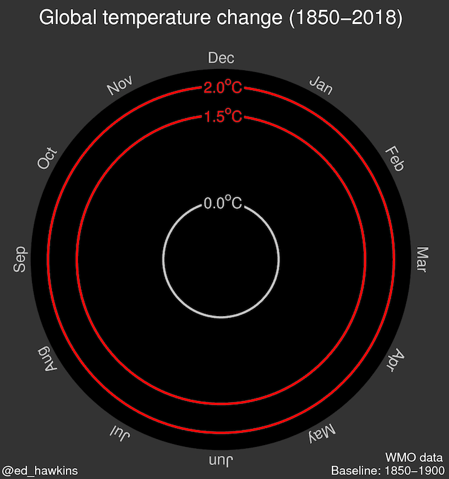
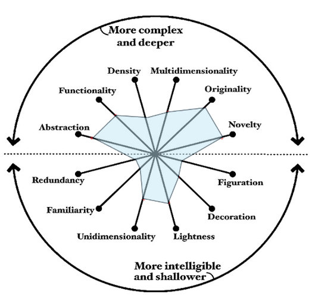

## Data Visualization Characterization
### Selected Visualization
**Type of Visualization:** Animated circular time-series (spiral chart) showing global temperature anomalies.

**Title:** Climate Spiral

**Author:** Ed Hawkins

**Organization:** University of Reading, United Kingdom

**Year Published:** 2016

### Main Visualization Goal (Audience)
- The main goal of the Climate Spiral visualization is to communicate the long-term warming trend of the Earth's climate in an intuitive and visually compelling way. It shows how global temperatures have increased over time, demonstrate the accelerating warming trend, and make climate change visually undeniable.
- The Climate Spiral was designed for a wide audience, including scientists and researchers, policymakers, journalists, educators, and the general public.

### Visualization Dimensions Using the Visualization Wheel
Using Alberto Cairo (2011), the Climate Spiral can be characterized along several dimensions as follows:  

- **Abstraction vs Figuration:** The visualization is highly abstract. It does not resemble real-world objects such as the Earth or weather systems. Instead, it represents temperature anomalies through circular geometry, radial distance, and color. Only minimal figurative elements are present, such as month labels arranged around the circle.

- **Functionality vs Decoration:** The visualization is primarily functional. Its spiral form and animation enhance engagement, but these elements do not obscure the data. The aesthetic qualities support comprehension rather than distract from it. Decoration is present, but it reinforces communication instead of functioning as ornamentation.

- **Density vs Lightness:** The visualization contains a large amount of information (monthly temperature data across more than 150 years). Despite this, the design remains relatively clean, uncluttered, and easy to interpret, with minimal text and labeling. It therefore balances high informational content with visual simplicity.

- **Multidimensional vs Unidimensional:** The visualization encodes time (animation and circular structure), temperature anomaly (radial distance), and months (angular position). However, conceptually it communicates one primary quantitative variable: temperature anomaly. Therefore, while structurally multidimensional, it is analytically focused on a single core variable, making it predominantly unidimensional in purpose.

- **Originality vs Familiarity:** The spiral format is highly distinctive. It does not use the traditional linear line charts typically associated with time-series climate data, making it less immediately familiar to traditional data readers. This makes the visualization highly original and innovative.

- **Novelty vs Redundancy:** The visualization has a strong novelty effect that attracts attention and increases public engagement. At the same time, it avoids redundant encoding and unnecessary repetition, keeping the design concise and focused on the main message.

## Main Drawbacks Following Alberto Cairo and Edward Tufte’s Recommendations and Principles

### According to Alberto Cairo

Alberto Cairo emphasizes truthfulness, clarity, and functionality. The Climate Spiral satisfies the criterion of truthfulness: it is based on reputable global temperature datasets and includes reference rings (e.g., 1.5°C and 2°C thresholds) that provide meaningful contextual benchmarks. The scale is not manipulated, and there is no distortion of proportional representation.

However, in terms of analytical clarity, the visualization prioritizes emotional impact and storytelling over precision. Exact numerical values are difficult to extract, as the emphasis is on the overall shape and outward expansion of the spiral rather than precise measurement. It is therefore more effective for communication and awareness than for detailed quantitative analysis.

### According to Edward Tufte

Edward Tufte advocates graphical integrity, a high data-ink ratio, minimal chartjunk, and the use of small multiples for comparison. The Climate Spiral performs well in maintaining graphical integrity. Most of the visual elements represent actual data, and there are no unnecessary decorative elements, 3D effects, or excessive labeling.

The primary drawback from Tufte’s perspective is the use of animation. Animation makes it harder to compare specific years directly because viewers cannot see all time points simultaneously. Tufte generally favors static displays and small multiples for precise comparison. A static alternative or complementary representation might improve analytical efficiency and comparability

## Graphical Variables Used and Their Suitability
According to Jacques Bertin, the main graphical variables are position, size, shape, colour (hue, value), orientation, and texture. In the Climate Spiral, the primary variables used are position and color.

1. Position: Position is the most powerful graphical variable for quantitative data, and it is used effectively in this visualization. Two types of position are employed: angular and radial. Angular position encodes the months of the year. The months are arranged around the circle, allowing viewers to recognize seasonal cycles and compare patterns across years. Radial position encodes temperature anomaly magnitude. The distance from the center increases as temperature anomalies rise, making warming visually perceptible and perceptually clear.

2. Colour (Hue and Value): Colour is used to reinforce temperature magnitude. The colour scheme choice is semantically appropriate. Hue differentiates cooler versus warmer periods, while value (lightness) supports the perception of increasing intensity. A gradient from cooler blues to warmer reds encodes increasing temperature anomalies, strengthening intuitive interpretation of warming trends.
 

